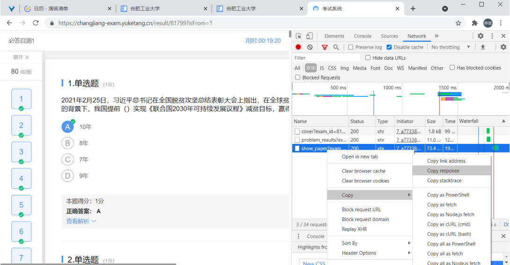

# 雨课堂形势与政策查题网站

## 要感谢的人:sparkling_heart::

感谢我的室友[**shanghaojia123**](https://github.com/shanghaojia-1)，是他率先将该项目的客户端版本做了出来，在后续的在线版开发过程中也给予了我大量的技术支持。

感谢**我的室友们**、**513寝室**、还有些**没留名字的同学**，它们在初期题库命中率低的情况下手动查题，没有他们的贡献就不会有项目最后95%+命中率的成功。

感谢我的朋友[**wine99**](https://github.com/wine99) ,是他对我开源精神的赞同，让我有动力写出了在线版本。

感谢从网站访问至这里的**你**，是你的探索精神:bouquet:让我的这段文字有了意义。

## 项目灵感:star2::

灵感来源于三张长图片，是某同学发给我室友的，里面包含了三个必答自测交卷后的答案。因为本次题库都是新题，网上基本找不到。不过既然交卷后会返回题目及答案，那么为什么不把这些题目收集起来呢？这样不就可以自建题库了嘛？

## 项目原理:secret::

那位同学选择了截图自建题库，而该项目则投机取巧地直接用浏览器的**开发者调试工具**抓取雨课堂返回给我的数据包。

就是上图中的show_paper，这个请求的response完整地返回了试卷的题目及答案，且格式是非常友好的JSON。

收集了同学们的数据包后，稍加处理（合并，去重）后便是这个项目的核心：[**题库**](https://github.com/Blackmegg1/Situation-and-Policies/blob/main/end/answer.json)。

**如何让同学们愿意给我们发题库呢**？这就是shanghaojia123的厉害之处了，他迅速地根据我提供的题目做出了[客户端版本](./client)，将客户端版本发给了一些同学，即使命中率不高，但的确有作用，同学们也就愿意将题库发给我们了。

有了题库后一切就变得非常简单了。可能你最疑惑的问题是：**如何从题库里找题呢**？其实非常简单，任何语言都会有字符串的匹配方法，如JS中的`String.search()`，遍历题库所有问题，如果匹配到就返回答案。翻看我的commit，[基本实现离线查题](https://github.com/Blackmegg1/Situation-and-Policies/commit/ab992978525dff1413958d2ee5f27dd680cc13d2)就是做完了以上的工作。

## 如何将项目上线:globe_with_meridians::

考虑到很多人对这个过程的理解很模糊，我将这部分单独出来简单说明一下。

想做一个供大家访问在线的网页，你需要 ：**一个服务器 + 一点前端基本知识** ，而如果你想要将你做得网页推广出去，那么你还需要**一个好记的域名**。  

这个项目[后端](https://github.com/Blackmegg1/Situation-and-Policies/tree/main/end)使用Node.js做了一个基本的HTTP服务器，[前端](https://github.com/Blackmegg1/Situation-and-Policies/tree/main/front)是纯html + css + js，这也是界面丑的原因。前后端使用HTTP通信，前端负责将题目发给后端，后端负责查询题库后将答案回复给前端。原理很简单，都是计网学过的知识。

#### 两个细节：

1. 前端代码和后端代码都是运行在服务器上的，想配置好服务器环境（nginx , Node.js ）并不容易，这里我推荐一篇博客，这也是带我入门的一篇博客:[从零搭建Hexo博客并部署阿里云服务器（奶妈级教学）](https://blog.csdn.net/NoCortY/article/details/99631249?ops_request_misc=%257B%2522request%255Fid%2522%253A%2522160525661819724836707365%2522%252C%2522scm%2522%253A%252220140713.130102334..%2522%257D&request_id=160525661819724836707365&biz_id=0&utm_medium=distribute.pc_search_result.none-task-blog-2~all~baidu_landing_v2~default-5-99631249.first_rank_ecpm_v3_pc_rank_v2&utm_term=%E4%BA%91%E6%9C%8D%E5%8A%A1%E5%99%A8%E6%90%AD%E5%BB%BA%E5%8D%9A%E5%AE%A2&spm=1018.2118.3001.4449)。
2. 写网站要站在用户的角度，改善交互体验，如本项目是个查题网站，那么监听网页的[粘贴事件](https://github.com/Blackmegg1/Situation-and-Policies/commit/77dc76ca828fa732fb135d1de3f6d31ae8a122e1#r50471449)、回车事件就十分重要。同学们查题时往往是打开两个浏览器分屏，所以无论窗口变大变小都要让查题区域居中。这些细节实现起来很简单，但可以极大提高用户体验。

## 写在最后的话:happy::

整个项目代码编写用了约8小时，这个项目的代码很简单，并没有什么值得学习的地方，任何对前端有所了解的同学都能写得出来。比起代码我更希望阅读到这里的你从这个项目中学到：

1. [开源精神](https://www.zhihu.com/question/20559450)，将自己辛苦搜的题目贡献出来是个伟大的决定，我理解的开源精神便在此，即使题库贡献者们没有参与代码的编写，但也一定是这个项目的Contributor！:raised_hands:
2. 用技术去简化操作，比起从截图中慢慢找，写个搜题软件是不是更方便呢？生活中有很多可以简化的操作，作为一个程序员，你应该试着去发现它们。:mag:
3. 任何一个项目最难的就是第一行代码，当你写下第一行代码，一切就变得简单了，就只剩遇到问题->解决问题->遇到问题->......所以大胆去写吧，通过行动把你那些有趣的点子变成现实。:bulb:

